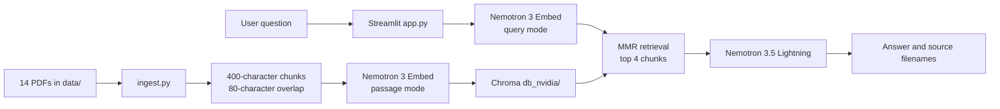

# Harmony Aesthetics RAG Chatbot

A Streamlit retrieval-augmented generation (RAG) application for answering questions about the Harmony Aesthetics & Wellness PDFs in `data/`. It uses NVIDIA Nemotron 3 Embed for retrieval, Chroma for vector storage, and NVIDIA Nemotron 3.5 Lightning for answer generation.

> [!IMPORTANT]
> This is a prototype, not a production-ready medical assistant. It does not yet enforce the emergency, disclaimer, and human-escalation rules described in the knowledge base. See [Known limitations and safety gaps](#known-limitations-and-safety-gaps).

## How it works



The document and question vectors must come from the same embedding model. The application therefore uses `nvidia/nemotron-3-embed-1b` for both, with the API-required `passage` and `query` modes. The retrieved chunks and question are then sent to `nvidia/nemotron-3.5-lightning-30b-a3b` to produce the answer.

## Repository layout

| Path | Purpose |
| --- | --- |
| `app.py` | Streamlit UI and conversational retrieval chain |
| `ingest.py` | PDF loading, chunking, NVIDIA embedding, and Chroma persistence |
| `nvidia_embeddings.py` | LangChain-compatible NVIDIA embedding adapter |
| `nvidia_chat.py` | NVIDIA Lightning chat-model configuration |
| `requirements.txt` | Reproducible Python dependencies |
| `tests/` | Unit tests for embedding modes, batching, configuration, and key validation |
| `data/` | Fourteen PDF knowledge-base documents |
| `db/` | Legacy 768-dimensional Ollama database; not used by the NVIDIA app |
| `db_nvidia/` | Generated 2,048-dimensional NVIDIA database; ignored by Git |
| `Run.bat` | Windows shortcut for `streamlit run app.py` |
| `venv/` | Checked-in environment from the original computer; do not use it |

## Requirements

- Python 3.10 or newer
- Internet access
- An NVIDIA API key with access to both configured models

The NVIDIA path sends extracted PDF text and user questions to NVIDIA's hosted API. Review NVIDIA's data-handling terms before indexing private, medical, or otherwise regulated documents.

## Installation

Clone the repository and create a fresh environment. The committed `venv/` is machine-specific and is not portable.

```powershell
git clone https://github.com/peyton150-startup/Rag-Chatbot-Python-.git
cd Rag-Chatbot-Python-
py -3.10 -m venv .venv
.\.venv\Scripts\Activate.ps1
python -m pip install --upgrade pip
python -m pip install -r requirements.txt
```

Set the API key only in the shell that runs ingestion and Streamlit:

```powershell
$env:NVIDIA_API_KEY = "nvapi-your-key-here"
```

Never put the real key in source code, `.env` files committed to Git, screenshots, logs, or issue reports.

## Build the vector database

Run ingestion from the repository root:

```powershell
python ingest.py
```

The command should report all `14` source documents and write the generated collection to `db_nvidia/`. That directory is intentionally separate from the legacy Ollama `db/` because the two stores use incompatible vector dimensions.

`ingest.py` does not deduplicate an existing collection. Before re-indexing changed PDFs, move the previous generated directory aside and then ingest again:

```powershell
Move-Item db_nvidia db_nvidia.backup
python ingest.py
```

Keep the backup until the replacement database has been verified.

## Run the app

Start Streamlit from the same shell that contains `NVIDIA_API_KEY`:

```powershell
streamlit run app.py
```

Alternatively:

```powershell
.\Run.bat
```

Open the local URL printed by Streamlit, normally `http://localhost:8501`, and ask a question such as:

- `Where is the Kensington office?`
- `What is the downtime for Scarlet RF microneedling?`
- `How much does a VI Peel cost?`

The answer should be followed by an expandable list of source PDF filenames.

## Model configuration

The implementation uses NVIDIA's OpenAI-compatible API at `https://integrate.api.nvidia.com/v1`:

| Job | Model | Important setting |
| --- | --- | --- |
| Index PDF chunks | `nvidia/nemotron-3-embed-1b` | `input_type="passage"` |
| Embed a question | `nvidia/nemotron-3-embed-1b` | `input_type="query"` |
| Generate an answer | `nvidia/nemotron-3.5-lightning-30b-a3b` | non-streaming, 1,024 output tokens |

The embedding model returns 2,048-dimensional vectors. `nvidia_embeddings.py` batches requests and supplies the correct input type automatically. The first working version intentionally avoids the sample's large reasoning budget and token streaming because the existing LangChain retrieval chain expects a completed answer.

See NVIDIA's [Nemotron 3 Embed model card](https://build.nvidia.com/nvidia/nemotron-3-embed-1b/modelcard), [embedding API reference](https://docs.api.nvidia.com/nim/reference/nvidia-nemotron-3-embed-1b-infer), and [Nemotron 3.5 Lightning chat API reference](https://docs.api.nvidia.com/nim/reference/nvidia-nemotron-3-5-lightning-30b-a3b-infer).

## Tests

Run the unit suite from the repository root:

```powershell
python -m unittest discover -s tests -v
```

The tests do not make network requests or require a real API key.

## Troubleshooting

### `Set NVIDIA_API_KEY` error

Set the environment variable in the same PowerShell window used to run the command. Environment variables set in one terminal are not automatically available in another.

### `Vector database not found` error

Run `python ingest.py` successfully before starting Streamlit. By default both scripts use `db_nvidia/`. To choose another location, set the same `CHROMA_DB_DIR` value for both commands.

### Authentication or model-access error

Generate a current NVIDIA API key and confirm it has access to both model IDs listed above. Do not print the key while troubleshooting.

### Chroma dimension error

Do not point the NVIDIA app at the legacy `db/` directory. Rebuild `db_nvidia/` using the current embedding model.

### A new or edited PDF is ignored

Move the old `db_nvidia/` aside and rebuild. The ingestion script does not provide incremental synchronization or deduplication.

### The committed `venv/` does not run

This is expected on another computer. It references the original machine's Python installation. Create `.venv` using the installation steps above.

## Verification status

Reviewed on September 21, 2026:

- All four first-party Python modules pass syntax compilation.
- Six unit tests pass in a clean Docker environment.
- Live calls succeeded for `nvidia/nemotron-3-embed-1b` with a 2,048-dimensional result and for `nvidia/nemotron-3.5-lightning-30b-a3b` with a nonempty answer.
- The exact `OpenAI` embedding client and `ChatOpenAI` adapter used by the application passed live smoke tests together.
- All 14 PDFs are readable.
- The legacy checked-in Chroma database passes SQLite integrity checking, but it contains only 9 of the 14 PDFs and is not used by the NVIDIA implementation.
- Full NVIDIA ingestion succeeded with 566 chunks, 2,048-dimensional vectors, and all 14 source PDFs.
- A live Streamlit test entered `Where is the Kensington office?`, rendered the correct address, and retrieved `Office Details.pdf` as a source.

## Known limitations and safety gaps

- **Safety rules are not enforced.** Emergency keywords, medical escalation responses, disclaimers, and human-handoff rules appear in a PDF but are not deterministic application logic.
- **No first-interaction disclaimer.** The mandatory disclaimer described in the knowledge base is not displayed by the UI.
- **Conversation state is fragile.** `ConversationBufferMemory` is recreated on Streamlit reruns instead of being stored in `st.session_state`.
- **Raw model HTML is enabled.** Model output is rendered with `unsafe_allow_html=True`; sanitize or render it as plain Markdown before exposing the app to untrusted users.
- **Source citations are filenames only.** Answers do not include page numbers or supporting quotations.
- **No retrieval-quality evaluation.** The chunk size and top-four MMR retrieval settings have not been measured against a question set.
- **Limited resilience.** The application has no retry, rate-limit, timeout, or partial-ingestion recovery strategy.
- **Repository bloat.** The checked-in legacy `venv/` contains roughly 27,676 third-party files and should eventually be removed from Git history.

Do not use the prototype to diagnose conditions, determine treatment eligibility, handle emergencies, or replace a licensed provider.

## Production-readiness checks

Before deployment, test at least:

1. Service, price, location, preparation, and aftercare questions across all 14 PDFs.
2. Typos, ambiguous questions, and requests outside the knowledge base.
3. Pregnancy, medication, candidacy, and post-treatment concern prompts.
4. Emergency phrases such as breathing difficulty, vision changes, severe pain, or allergic reaction.
5. Prompt injection and malicious HTML payloads.
6. API downtime, rate limits, missing credentials, and missing or corrupt databases.
7. Answers against an approved reference set for retrieval and factual accuracy.

## License

No license file is included. Unless the repository owner adds one, standard copyright restrictions apply.
