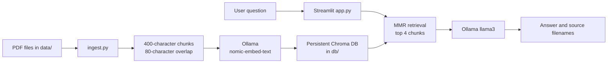

# Harmony Aesthetics RAG Chatbot

A retrieval-augmented generation (RAG) prototype for answering questions about Harmony Aesthetics & Wellness services, pricing, policies, preparation, and aftercare. The checked-in code uses Streamlit for the interface, Ollama for local embeddings and text generation, and Chroma for vector search over the PDFs in `data/`. A documented NVIDIA-hosted replacement is included below for computers where Ollama is unavailable.

> [!IMPORTANT]
> This repository is a prototype, not a production-ready medical assistant. The knowledge base contains medical and post-treatment guidance, but the application does not programmatically enforce the escalation rules in those documents. Review [Known limitations and safety gaps](#known-limitations-and-safety-gaps) before exposing it to users.

## How it works



`ingest.py` loads every PDF currently in `data/`, adds the filename as source metadata, splits the extracted text, creates embeddings with `nomic-embed-text`, and persists the result to `db/`.

`app.py` opens that database, retrieves four relevant chunks using maximal marginal relevance (MMR), sends the question and retrieved context to `llama3`, and displays the answer with its source filenames.

## Repository layout

| Path | Purpose |
| --- | --- |
| `app.py` | Streamlit UI and conversational retrieval chain |
| `ingest.py` | PDF loading, chunking, embedding, and Chroma persistence |
| `data/` | Fourteen PDF knowledge-base documents |
| `db/` | Checked-in Chroma database and HNSW index |
| `Run.bat` | Windows shortcut for `streamlit run app.py` |
| `venv/` | A checked-in, machine-specific Python 3.10 environment; do not rely on it |

## Prerequisites

- Python 3.10 is the repository's original runtime version.
- For the recommended NVIDIA path: internet access and an NVIDIA API key stored in `NVIDIA_API_KEY`.
- For the unchanged local path: [Ollama](https://ollama.com/download) running with `nomic-embed-text` and `llama3`.

The NVIDIA path sends PDF chunks and user questions to NVIDIA's hosted API. Do not use it with private or regulated content until the data-handling terms have been reviewed. The logo in the UI is also loaded from an external website.

## Installation

Clone the repository and enter it:

```powershell
git clone https://github.com/peyton150-startup/Rag-Chatbot-Python-.git
cd Rag-Chatbot-Python-
```

Create a fresh virtual environment. Do not activate the committed `venv/` directory: it contains absolute paths from the computer where it was created and is not portable.

```powershell
py -3.10 -m venv .venv
.\.venv\Scripts\Activate.ps1
python -m pip install --upgrade pip
python -m pip install `
  streamlit==1.32.2 `
  langchain==0.1.16 `
  langchain-community==0.0.34 `
  langchain-openai==0.1.3 `
  openai==1.109.1 `
  chromadb==0.4.24 `
  pypdf==4.2.0
```

`langchain-openai==0.1.3` is compatible with the repository's LangChain 0.1.x stack. The other original versions match the relevant package metadata committed under `venv/`. The project does not currently provide a `requirements.txt` or `pyproject.toml`.

## Recommended NVIDIA replacement (no Ollama)

Use `nvidia/nemotron-3.5-lightning-30b-a3b` to generate answers and `nvidia/nemotron-3-embed-1b` to embed both the PDFs and questions. The embedding model is designed for RAG, returns 2,048-dimensional vectors, and requires `passage` mode while indexing and `query` mode while searching.

The old `langchain-nvidia-ai-endpoints` release compatible with this repository rejects these newer public model IDs. The tested path is therefore NVIDIA's OpenAI-compatible client for embeddings and LangChain's `ChatOpenAI` adapter for Lightning. Both use `https://integrate.api.nvidia.com/v1`.

### 1. Set the API key

Generate an NVIDIA API key, then set it in the PowerShell session that will run ingestion and Streamlit:

```powershell
$env:NVIDIA_API_KEY = "nvapi-your-key-here"
```

Do not paste the real key into either Python file or commit it to Git.

### 2. Add `nvidia_embeddings.py`

The generic OpenAI embeddings adapter cannot automatically send different `input_type` values for documents and questions. Add this small LangChain-compatible adapter at the repository root:

```python
import os

from langchain_core.embeddings import Embeddings
from openai import OpenAI


class NVIDIAOpenAIEmbeddings(Embeddings):
    def __init__(self, batch_size: int = 50):
        api_key = os.environ.get("NVIDIA_API_KEY")
        if not api_key:
            raise RuntimeError("Set NVIDIA_API_KEY before using embeddings.")

        self.client = OpenAI(
            base_url="https://integrate.api.nvidia.com/v1",
            api_key=api_key,
        )
        self.batch_size = batch_size

    def _embed(self, texts: list[str], input_type: str) -> list[list[float]]:
        vectors = []
        for start in range(0, len(texts), self.batch_size):
            response = self.client.embeddings.create(
                model="nvidia/nemotron-3-embed-1b",
                input=texts[start : start + self.batch_size],
                encoding_format="float",
                extra_body={"input_type": input_type, "truncate": "END"},
            )
            vectors.extend(item.embedding for item in response.data)
        return vectors

    def embed_documents(self, texts: list[str]) -> list[list[float]]:
        return self._embed(texts, "passage")

    def embed_query(self, text: str) -> list[float]:
        return self._embed([text], "query")[0]
```

### 3. Change `app.py`

Replace the two Ollama imports with:

```python
import os

from langchain_openai import ChatOpenAI

from nvidia_embeddings import NVIDIAOpenAIEmbeddings
```

Before constructing the models, fail with a clear UI message when the key is missing:

```python
if not os.getenv("NVIDIA_API_KEY"):
    st.error("Set NVIDIA_API_KEY before starting the app.")
    st.stop()
```

Replace the two Ollama model constructors with:

```python
api_key = os.environ["NVIDIA_API_KEY"]
embeddings = NVIDIAOpenAIEmbeddings()

llm = ChatOpenAI(
    model="nvidia/nemotron-3.5-lightning-30b-a3b",
    base_url="https://integrate.api.nvidia.com/v1",
    api_key=api_key,
    temperature=0.2,
    top_p=0.95,
    max_tokens=1024,
    streaming=False,
)
```

For the first working RAG version, do not enable the sample's 16,384-token reasoning budget or token streaming. The existing chain expects a completed answer, and a short grounded answer does not need that budget.

### 4. Change `ingest.py`

Replace:

```python
from langchain_community.embeddings import OllamaEmbeddings
```

with:

```python
from nvidia_embeddings import NVIDIAOpenAIEmbeddings
```

Then replace the Ollama constructor with:

```python
if not os.getenv("NVIDIA_API_KEY"):
    raise RuntimeError("Set NVIDIA_API_KEY before running ingestion.")

embeddings = NVIDIAOpenAIEmbeddings()
```

### 5. Rebuild Chroma

This step is mandatory. The checked-in Chroma collection contains 768-dimensional Ollama vectors. Nemotron 3 Embed produces 2,048-dimensional vectors, and a question must be embedded by the same model used to index the documents.

From the repository root:

```powershell
Move-Item db db.ollama-backup
python ingest.py
```

The ingestion script should report `14` source documents. Keep the backup until the NVIDIA version has been tested, then remove it if it is no longer needed.

### 6. Run and test one question

```powershell
streamlit run app.py
```

Open the displayed local URL and ask `Where is the Kensington office?` The answer should cite `Office Details.pdf`. If that works, try one question whose answer appears in each of the other PDFs.

The NVIDIA embedding endpoint requires `input_type="passage"` for indexing and `input_type="query"` for search; using the wrong mode substantially reduces retrieval accuracy. See NVIDIA's [Nemotron 3 Embed model card](https://build.nvidia.com/nvidia/nemotron-3-embed-1b/modelcard), [embedding API reference](https://docs.api.nvidia.com/nim/reference/nvidia-nemotron-3-embed-1b-infer), and [Nemotron 3.5 Lightning chat API reference](https://docs.api.nvidia.com/nim/reference/nvidia-nemotron-3-5-lightning-30b-a3b-infer).

## Legacy Ollama setup

Only use this section on a computer where Ollama works.

Download the two models used by the code:

```powershell
ollama pull nomic-embed-text
ollama pull llama3
ollama list
```

## Build or refresh the knowledge base

The checked-in database is stale: it contains 664 chunks from only 9 of the 14 PDFs currently in `data/`. Before relying on the answers, move the shipped database aside and build a fresh one:

```powershell
Move-Item db db.shipped-backup
python ingest.py
```

A successful ingestion prints the number of chunks and source documents indexed. With the current repository, the source-document count should be `14`.

`ingest.py` does not synchronize or clear an existing collection. Running it repeatedly against the same `db/` directory can duplicate content. Rebuild into an empty `db/` whenever the PDFs change.

## Run the unchanged Ollama app

Make sure Ollama is running, then start Streamlit from the repository root:

```powershell
streamlit run app.py
```

On Windows, `Run.bat` runs the same command:

```powershell
.\Run.bat
```

Open the local URL printed by Streamlit, normally `http://localhost:8501`, and ask a question such as:

- `What is the downtime for Scarlet RF microneedling?`
- `How much does a VI Peel cost?`
- `Where is the Kensington office?`

The answer panel should be followed by an expandable list of the PDF filenames used as sources.

## Troubleshooting

### `ollama` is not recognized

Install Ollama, restart the terminal, and verify it is available:

```powershell
ollama --version
```

### Model not found

The model names are hard-coded in `app.py` and `ingest.py`. Pull both exact names:

```powershell
ollama pull nomic-embed-text
ollama pull llama3
```

### Cannot connect to Ollama

Start the Ollama application or service, then verify the local API responds:

```powershell
Invoke-RestMethod http://localhost:11434/api/tags
```

### Chroma dimension or collection errors

The checked-in collection uses 768-dimensional embeddings. Ensure `nomic-embed-text` is installed. If the store was created with a different embedding model, move `db/` aside and rerun `python ingest.py`.

### The committed `venv` does not run

This is expected on a different computer. It points to the original machine's Python installation. Create `.venv` using the installation steps above.

### A new or edited PDF is ignored

Rebuild the database from an empty `db/`. The ingestion script has no incremental-update or deduplication logic.

## Current verification status

The repository was reviewed on September 21, 2026.

- Both first-party Python files pass Python syntax compilation.
- The checked-in Chroma SQLite database passes `PRAGMA integrity_check` and opens as one 768-dimensional collection containing 664 chunks.
- All 14 PDFs are readable, but only 9 are represented in the checked-in collection.
- The committed `venv/` is not runnable on a clean machine because it references a missing Python 3.10 installation.
- Live NVIDIA calls succeeded for `nvidia/nemotron-3-embed-1b` (2,048-dimensional output) and `nvidia/nemotron-3.5-lightning-30b-a3b` (nonempty chat response).
- The documented `OpenAI` embedding client and `ChatOpenAI` adapter also succeeded together in a clean Docker container with the pinned LangChain 0.1.x dependencies.
- A full Streamlit-to-Chroma-to-NVIDIA test has not been run because the repository code still contains its original Ollama implementation; the section above specifies the required migration.

## Known limitations and safety gaps

- **Safety rules are not enforced.** Emergency keywords, medical escalation responses, disclaimers, and human-handoff rules appear in a PDF, but `app.py` has no system prompt or deterministic guardrail logic that guarantees those behaviors.
- **No first-interaction disclaimer.** The mandatory disclaimer described in the knowledge base is not displayed by the UI.
- **Conversation state is fragile.** `ConversationBufferMemory` is created at the top level on every Streamlit rerun instead of being stored in `st.session_state`, so multi-turn history may be lost.
- **Raw model HTML is enabled.** The generated answer is interpolated into HTML and rendered with `unsafe_allow_html=True`. Do not expose the current app to untrusted users without escaping or sanitizing model output.
- **The checked-in database is incomplete.** Five PDFs are absent from it: Chemical Peels/PRX, Laser Hair Removal, Office Details, Osmosis Facials, and Scarlet RF Microneedling.
- **No automated tests or dependency manifest.** Reproducible installation and regression checking are manual.
- **Limited error handling.** Missing models, an unavailable Ollama service, a missing database, or ingestion failures surface as raw runtime errors.
- **Source citations are filenames only.** Answers do not show page numbers or quoted supporting passages.
- **Repository bloat.** The committed `venv/` contains roughly 27,676 third-party files and should normally be replaced by a dependency manifest plus `.gitignore` entry.

Do not use the current prototype to diagnose conditions, determine treatment eligibility, handle emergencies, or replace a licensed provider. Production deployment should add deterministic emergency handling, medical disclaimers, human escalation, output sanitization, session-state management, tests, logging, and a reproducible build.

## Suggested production-readiness checks

Before deployment, test at least these cases:

1. Normal service, pricing, location, preparation, and aftercare questions.
2. Questions whose answer is in each of the 14 PDFs.
3. Typos, ambiguous questions, and requests outside the knowledge base.
4. Pregnancy, medication, candidacy, and post-treatment concern prompts.
5. Emergency phrases such as breathing difficulty, vision changes, severe pain, or an allergic reaction.
6. Prompt-injection and malicious HTML payloads.
7. Model API downtime, missing credentials, missing/corrupt database files, and empty retrieval results.

## License

No license file is included. Unless the repository owner adds one, standard copyright restrictions apply.
